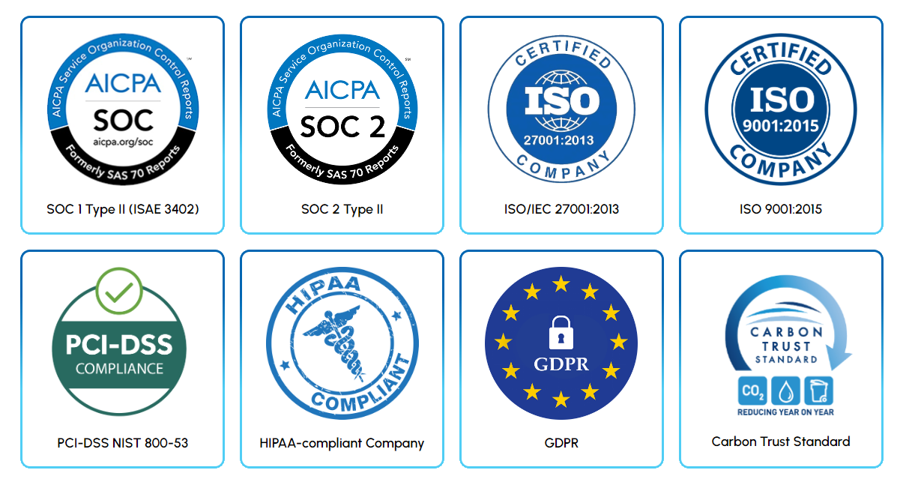

# 💜 Polyglot Observability

> Polyglot comes from Greek _polyglōttos_, a combination of **poly** - _"many" or "multi"_ - and **glōtta** for _"language_.

_That's us_. Gigapipe is a Polyglot platform designed around the Observability standards the world already loves 💜

 

### ☝️ Why did we launch Gigapipe? 

Our product values and design principles are simple:

✔️ We don't like metered solutions. Our plans are unlimited. 
✔️ We don't like dynamic pricing. Our service costs are fixed. 
✔️ We don't like vendor lock-ins. Our platform speaks freely. 
✔️ We don't like monopolies. Our products don't depend on AWS.

> _We needed a powerful all-in-one Observability stack for ourselves, so we made one for everybody!_

### 💎 Independence

Our stack is _protocol compatible_ with many projects and products - _without depending on any_.  
Our core engine and APIs are all developed from scratch _("clear room")_ and _completely opensource_.

### ⚡ Solid Performance

Our stack leverages the **ClickHouse** and **DuckDB** OLAP engines for storage, fast analytics and scalable performance.  
We develop our data engines and database extensions standing on the shoulders of giants.

### 🍖 Underdog-ness

Our pricing model is different because we are different - and so are our amazing dedicated hosting and VPS partners.  
We don't run on AWS. We are not VC controlled. We are born and made in EU - by humans for humans.

### ⚖️ Compliance 

